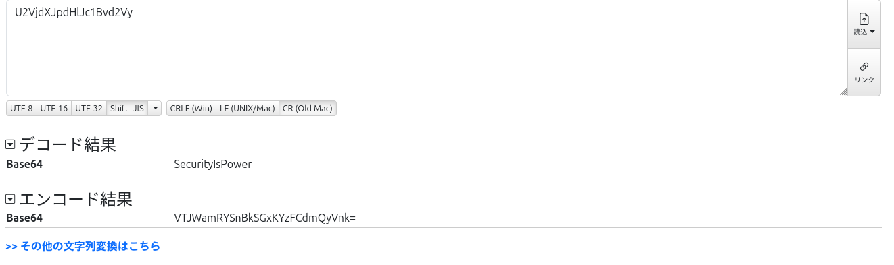
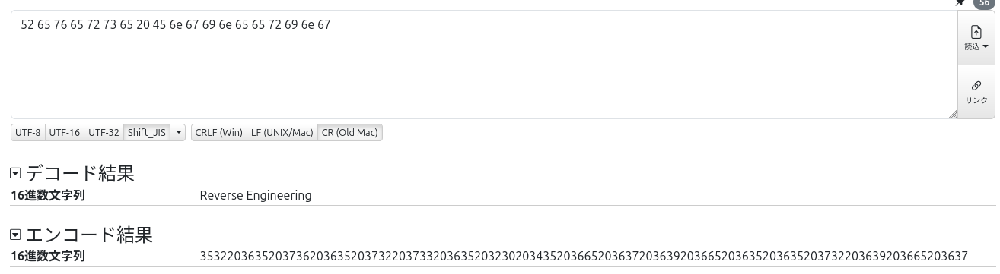
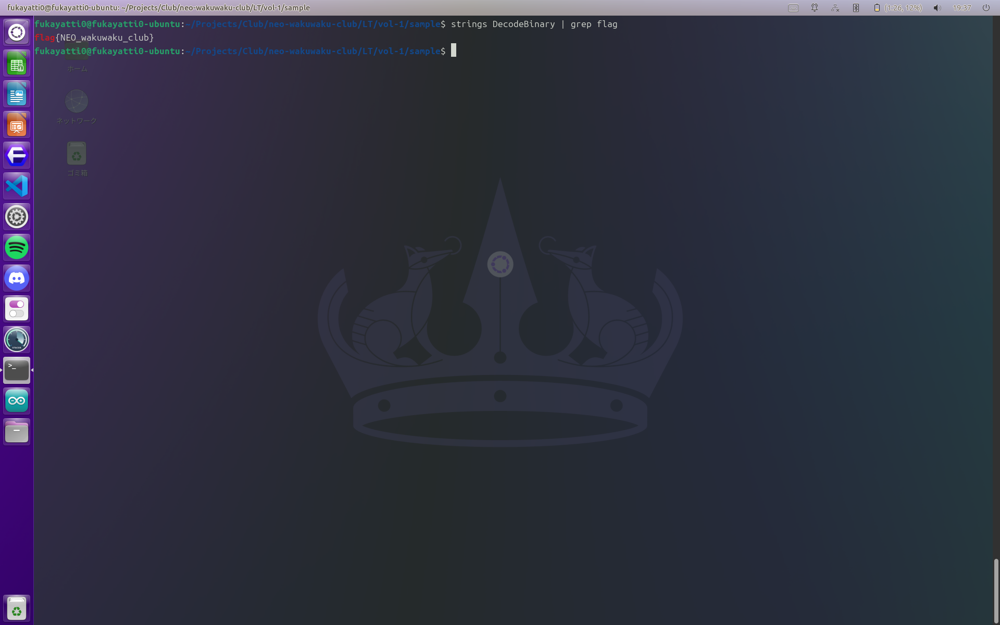

# CTF の魅力を探る

---

## 🌟 CTF とは？

- **Capture The Flag**の略で、セキュリティ技術を競い合うエキサイティングな競技
- 仮想環境で行われる _"旗取りゲーム"_ で、特定の文字列（フラグ）を発見してポイントを獲得
- 個人またはチームで参加可能で、攻撃と防御の両方を学べる絶好の機会

---

## 主な形式

- **Jeopardy 形式**：カテゴリー別の問題を解き、難易度に応じたポイントを獲得
  - Web セキュリティ、フォレンジックス、暗号理論、リバースエンジニアリング、バイナリ解析など多彩なカテゴリー
- **Attack & Defense 形式**：リアルタイムの攻防戦で、自身のサーバーを防御しつつ他チームを攻撃
  - チームワークと戦略性が求められる

---

## なぜ CTF に参加するのか？

- **スキルの向上**
  - 現場で役立つセキュリティ知識と技術を習得
  - 問題解決能力の強化と論理的思考の養成
- **楽しさと挑戦**
  - 難問を解く達成感と新たな発見
  - ゲーム感覚での学習でクリエイティビティを高める
- **コミュニティとのつながり**
  - 同じ志を持つ仲間とのネットワーキング
  - チームワークの醍醐味を経験

---

## 学べるスキル

- **リバースエンジニアリング**
  - バイナリ解析やアセンブリの理解
- **エクスプロイト開発**
  - 脆弱性の発見とセキュリティ対策の考察
- **暗号学**
  - 暗号解読と暗号アルゴリズムの理解

---

- **フォレンジックス**
  - データ復元や痕跡調査の技術
- **ウェブセキュリティ**
  - XSS、SQL インジェクション対策、セッション管理など

---

## 簡単な CTF のサンプル問題

初心者向けのシンプルな問題で CTF を体験してみましょう！

---

### 問題 1: 基本的な暗号解読

> **説明:**
> 以下の暗号文を解読し、フラッグ形式 `flag{...}` で答えを提出してください。
>
> ```base64
> U2VjdXJpdHlJc1Bvd2Vy
> ```

**ヒント:**

- この暗号文は Base64 エンコードされています。

**キーワード:**

- Base64 デコード

---

### 問題 1: 解説

Base64 デコードすると `SecurityIsPower` が得られます。
よって、フラグは `flag{SecurityIsPower}` となります。

オンラインツールや以下のコマンドで解けます：

```bash
echo "U2VjdXJpdHlJc1Bvd2Vy" | base64 -d
```



---

### 問題 2: 暗号学の基礎

> **説明:**
> 以下の暗号文を解読し、フラッグ形式 `flag{...}` で答えを提出してください。
>
> ```hex
> 52 65 76 65 72 73 65 20 45 6e 67 69 6e 65 65 72 69 6e 67
> ```

**ヒント:**

- 16 進数（Hex）エンコードされています。ASCII 文字に変換してみましょう。

**キーワード:**

- 16 進数 文字 変換

---

### 問題 2: 解説

16 進数の各バイトを ASCII 文字に変換すると `Reverse Engineering` が得られます。
よって、フラグは `flag{ReverseEngineering}` となります。

以下のようなツールを使って解くことができます：

---

Python の場合

```python
bytes.fromhex("52 65 76 65 72 73 65 20 45 6e 67 69 6e 65 65 72 69 6e 67").decode()
```

Dencode の場合



---

## 始めるには？

- **オンラインリソースを活用**
  - [CTF Time](https://ctftime.org)：世界中の CTF 情報が集約
  - [CpawCTF](https://ctf.cpaw.site/)：初心者に優しい問題が多数(日本語)
  - [OverTheWire](https://overthewire.org)：サーバーとセキュリティの基礎を学習
  - [TryHackMe](https://tryhackme.com)や[Hack The Box](https://hackthebox.eu)：仮想環境でのハッキング演習
- **大会への参加**
  - KOSEN セキュリティコンテスト 2024(Jeopardy 形式、高専機構主催)
  - TRICON4S 学生向け CTF(Jeopardy 形式、茨城県警主催)

---

## 💡 まとめ

- **CTF は学びと成長の場**
  - 多岐にわたる技術分野を網羅し、実践的なスキルを身につける
- **楽しみながらスキルアップ**
  - ゲーム感覚でセキュリティを学び、達成感を得られる
- **今すぐ始めよう！**
  - 最初の一歩を踏み出して、サイバーセキュリティの世界へ飛び込もう！

---

# ご清聴ありがとうございました

- **質問はありますか？**

---

## 特別問題: リバースエンジニアリング

> **説明:**
> 以下のバイナリファイルを解析し、フラグ形式 `flag{...}` で答えを提出してください。
>
> [ダウンロードリンク](https://github.com/fukayatti0/neowaku-LT/raw/refs/heads/main/vol-1/sample/DecodeBinary)

---

**ヒント:**

- `strings` コマンドと `grep` コマンドを使ってバイナリ内の文字列を確認してみましょう。
  フラグは flag{...}という形で隠されています

---

### 特別問題: 解説

バイナリファイル内の文字列を検索することで、フラグを見つけることができます。

コマンド実行：

```bash
strings DecodeBinary | grep flag
```

このコマンドにより `flag{NEO_wakuwaku_club}` が得られます。
これは、バイナリ解析の基本的なテクニックの一つで、実際の CTF でもよく使用される手法です。


